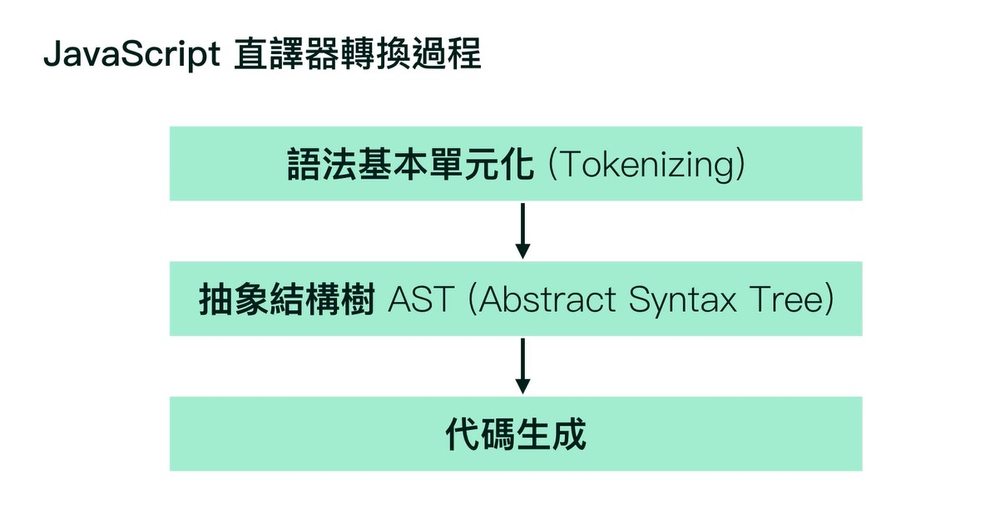

# JavaScript 必修篇:  前端修練全攻略- 最終作業

## [TodoList](https://jimmyfang-ai.github.io/js-todoList/todoList/)


## [蔬菜水果網](https://jimmyfang-ai.github.io/js-todoList/vegeList/)

----


# 執行環境、作用域

## JavaScript 是如何運行的
 
 JavaScript是直譯式語言，彈性較高，不須預先定義型別。

 程式碼透過直譯器將代碼生成並運行，錯誤會直接反映在環境中。

**運行過程:**


**JavaScript直譯器轉換過程:**



**javascript範例:**
```javascript
let  ming = "小明"; 
```
編譯過程:

  - 語法單元化(Tokenizing):
    會先將每行程式碼抽字詞取出來一一解析。
   
  - 抽象結構樹(tree):
    將解析完的單元(Token)，定義變數及值，此時還未運行，要等代碼生成後才會運行。

  - 代碼生成

從[編譯網站](https://esprima.org/demo/parse.html#)看轉換過程。


## 執行的錯誤情境 LHS, RHS


**LHS(賦予值):**
> 用來`賦予值到左側的變數`上

```javascript
// 宣告變數 ming 並透過 "=" 將"小明"的值賦予到左側的變數上。
let  ming = "小明"; 
```

**RHS(取值):**
>`取值來自於右側的變數`上

```javascript
// 宣告變數 ming 並透過 "=" 將"小明"的值賦予到左側的變數上。
let  ming = "小明"; 

// 透過讀取 ming變數 取得在 "=" 右邊 "小明"的值
console.log(ming);


// LHS
// 宣告 man 變數 透過 "=" 將ming變數的值賦予到左側的變數上。

// RHS
// 透過將 ming變數 去讀取 小明的值。
let man = ming;

// 透過讀取 man變數 取得在 "=" 右邊 ming變數的值
console.log(man);
```
     
**錯誤情境:**

**LHS 錯誤**
>可透過開發者工具觀看到，會跑出 LHS 錯誤訊息，
```javascript
let  ming = "小明"; 

//  數字 1 的值無法被賦予到左側變數上
"小明" = 1;
```


**RHS 的錯誤**
> 與LHS 錯誤訊息會有點不同，RHS並不會直接顯示出 RHS 的錯誤，他只會出現類似「ReferenceError: min is not defined」這種的錯誤訊息。
```javascript

let  ming = "小明"; 
console.log(min);
```


## 語法作用域(Lexical scope)